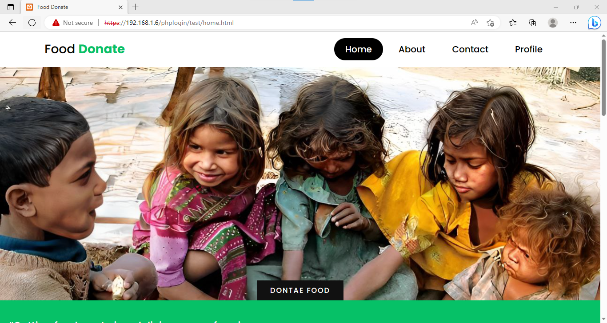
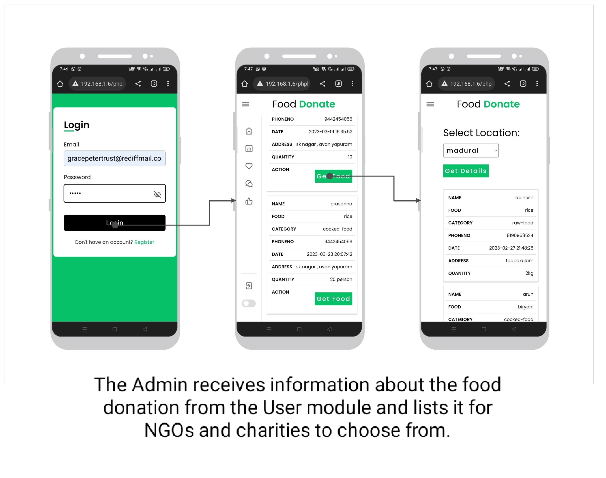

# Food Waste Management System

## 📌 Overview
The Food Waste Management System is a web-based platform designed to connect donors, NGOs, and delivery partners to reduce food wastage. It allows users to donate leftover food, track deliveries, and manage feedback. This system is suitable for restaurants, individuals, and organizations who want to contribute to reducing hunger and food waste.

---

## 🚀 Features
- User Authentication – Sign up, login, and manage profiles.   
- Food Donation Form – Submit details about food donations.     
- Admin Panel – Manage donations, users, and feedback.   
- Delivery Management – Track and manage food delivery.    
- Feedback System – Collect and store user feedback.   
- Chatbot – Provide quick guidance to users.   
- Analytics – View donation statistics.   

---

## 🛠️ Tech Stack
- Frontend: HTML, CSS, JavaScript    
- Backend: PHP   
- Database: MySQL   
- Other: SQL scripts for table setup

---

## 📂 Project Structure
```plaintext
food-waste-management-system-main/
│── about.html                # About page
│── connection.php            # Database connection
│── contact.html              # Contact page
│── delete_donation.php       # Remove donation record
│── delivery.html              # Delivery info page
│── edit_profile.php           # Edit user profile
│── feedback.php               # Feedback form processing
│── fooddonateform.php         # Donation form
│── home.html                  # Homepage
│── index.html                 # Landing page
│── login.php                  # User login
│── logout.php                 # Logout script
│── profile.php                # User profile page
│── setup_feedback_table.sql   # SQL script for feedback table
│── signin.php / signup.php    # User authentication pages
│
├── admin/                     # Admin dashboard files
├── chatbot/                   # Chatbot UI and scripts
└── assets/                    # CSS, JS, Images (if any)
```

---

## 🛠️ Installation (Using XAMPP)
1. Download and install [XAMPP](https://www.apachefriends.org/)
2. Place the `food-waste-management-system-main` folder inside the `htdocs` directory of XAMPP
3. Start **Apache** and **MySQL** from the XAMPP Control Panel
4. Import the SQL files in `phpMyAdmin` to set up the database
5. Open the project in your browser:
   ```
   http://localhost/food-waste-management-system-main/
   ```

---
## Screenshots

### Homepage
  

### AdminPage
 

### Delivery
  

<p align="center">
  
</p>

---

## 🤝 Contribution
Feel free to fork this repository, make improvements, and create a pull request.

---

## 📜 License
This project is licensed under the [MIT License](LICENSE).
